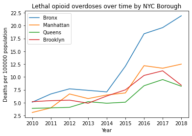
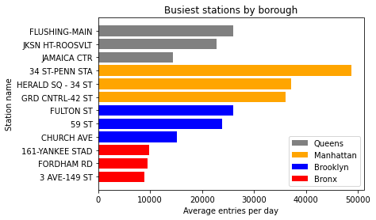
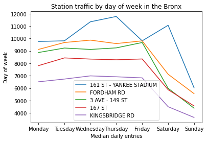

## **Preventing opioid overdoses in NYC**

### By: Ryan Solava

#### Abstract

This project uses the MTA turnstile dataset to find locations to post life saving informational posters with the goal of preventing opioid overdoses. Using data from the New York State Department of Health, we found that the Bronx was the borough most affected by the opioid epidemic. We were able to use the MTA turnstile data to find the top stations in the Bronx as well as the other boroughs. This allows us to recommend particular stations to begin displaying these posters. We then plot these stations on a map to see how well distributed they are geographically.

#### Design

The opioid epidemic has been a large problem across the United States, and it is only getting worse lately due to COVID-19 and the introduction of the potent drug fentanyl to the market. HealingNYC is a program started in 2016 to address the opioid crisis in New York City. Two of the strategies for this program are:

* **Strategy 3:** Educate New Yorkers about
 effective treatment for opioid misuse
 and addiction

 * **Strategy 10:** Use data to target outreach and
 take action

 each of which this project falls squarely under. Information about addiction treaments centers and naxolone, a life saving medication used during an overdose, can reduce fatalities. So this project looks to display informational posters in MTA subway stations. These stations are highly trafficked, so many people can be reached this way.

 #### Data

* [New York City MTA turnstile data](http://web.mta.info/developers/turnstile.html) We used the data from July, August, and September of 2021. A row of this data is one reading of a particular turnstile with the current reading on the turnstile. This was aggregated to the total number of entries by station and by day. 32 stations were dropped from this dataset, since there could not be matched to a station in the following station location dataset.

* [Locations of New York City stations](https://data.cityofnewyork.us/Transportation/Subway-Stations/arq3-7z49) This dataset gives the station name and location (longitude/latitude) for the MTA stations. This data was joined with the above dataset by station name. No stations in Staten Island appear in this dataset.

* **Geodata for New York City boroughs** GeoPandas (discussed more in the Tools section) provides the location of the boundry of the 5 boroughs of New York City. This is joined with the location data above by borough name.

* [New York State Opioid-related Data](https://www.health.ny.gov/statistics/opioid/) 45 rows of this dataset were used. The rows used gave the number of deaths due to opioid overdose per capita for the years 2010-2018 in the 5 boroughs of NYC (although Staten Island was eventually excluded).

 #### Algorithms

Many of the typical exploratory data analysis techniques were used here, including finding missing and suprious data, aggregating data in various ways, and visualizing this data. A subsequence matching algorithm was used to find likely matches between station names.

 #### Tools

* **SQLite** to create MTA turnstile database
* **SQLalchemy** to read database into Python
* **Python** and **Pandas** for data cleaning and exploration
* **Matplotlib** for data visualization
* **Geopandas** for handling and plotting geographic
* **Contextily** to find real maps to plot geographic data on

#### Communication

A number of useful visualizations are shown below, which demonstrate the main results. The slides and presentation also were a major way of communicated my results. Also, my code and visualizations are posted to my [personal GitHub](https://github.com/rsolava/mta-eda)

